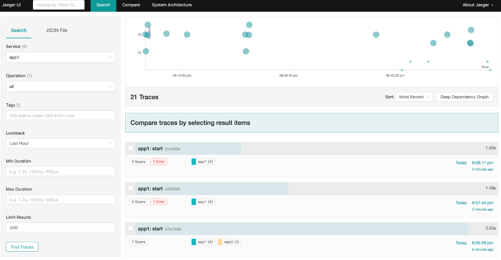
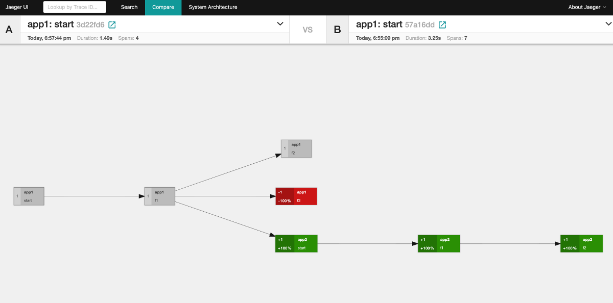
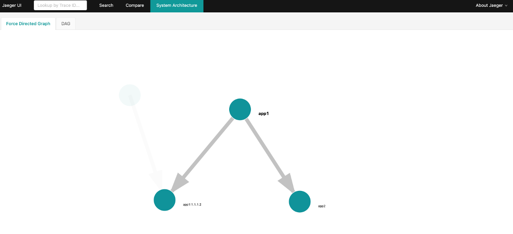
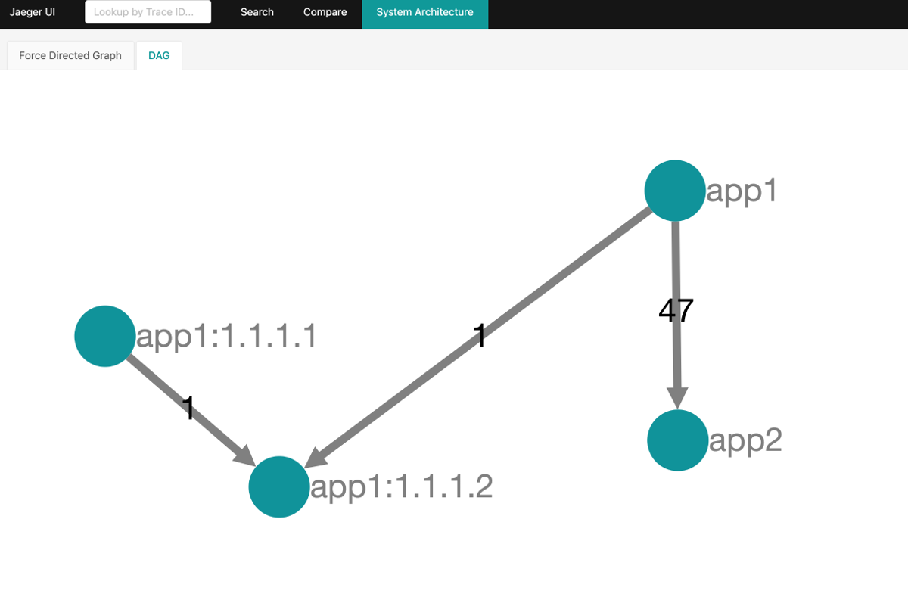

# go-trace-example

Example apps to play with Jaeger tracing. The point really is/was to get a little understanding on what's required to get _something_ to work that propagates a trace from the initial entrypoint (app1) through to app2 and ensure they all line up at the end, ensure that errors are flagged, add baggage to log entries, etc.

## app1

Entrypoint is app1, accessed via http://localhost:8080

- app1 will execute some internal function/s
- app1 will call app2 on http://localhost:8181/

## app2

App2 is accessed via http://localhost:8181

- app2 executes some internal function/s and returns the result

## curl / examples

Send correlationID (`jaeger-debug-id`) and baggage `jaeger-baggage` with a request, these are later stored and available to filter traces by.

```sh
curl -H "jaeger-debug-id: some-correlation-id" -H "jaeger-baggage: key=value,key2=value2" http://localhost:8080
```

## screenshots









